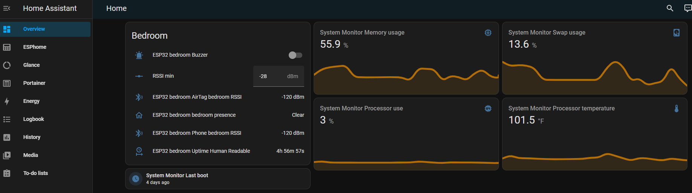
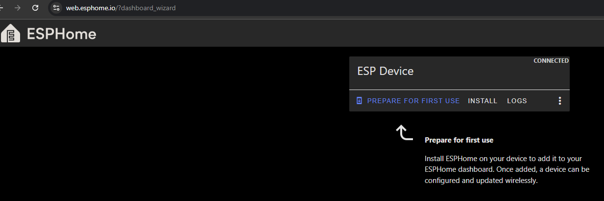
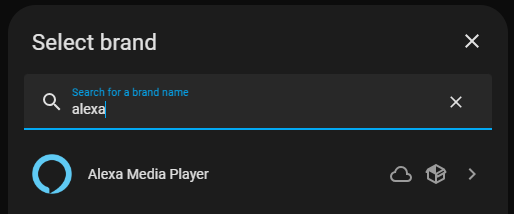
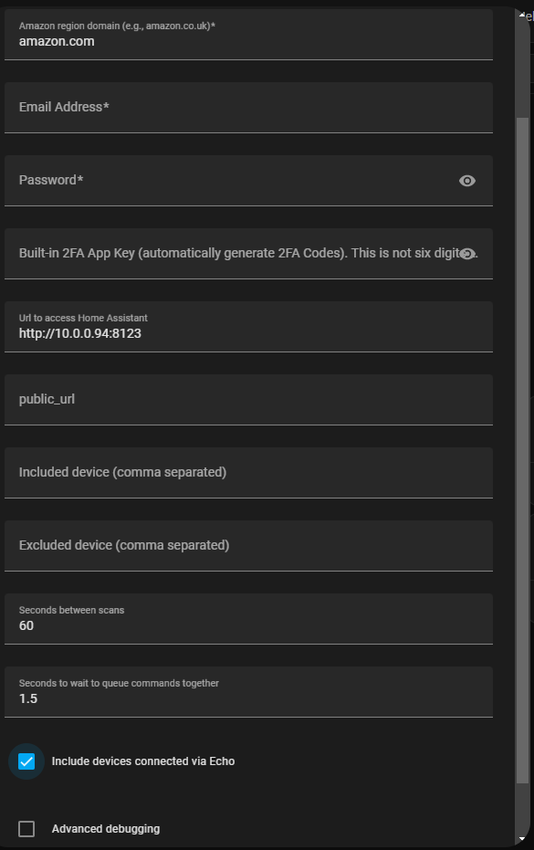
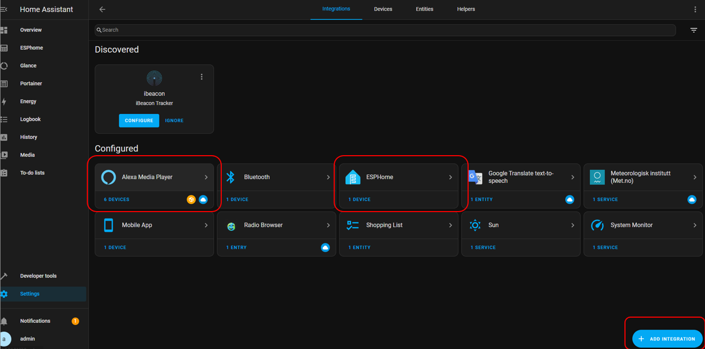
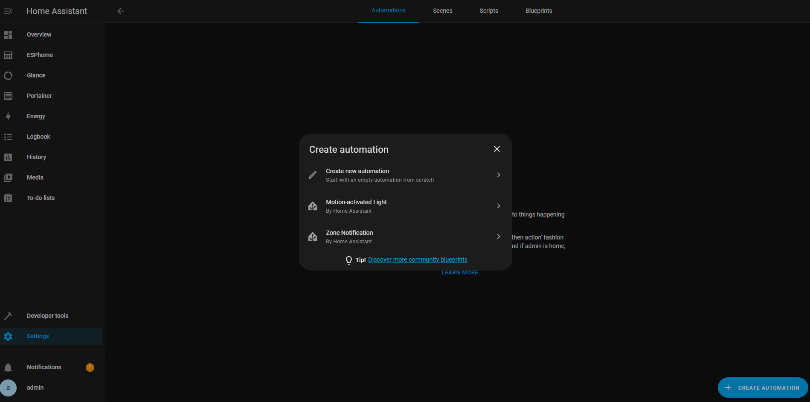

# Introduction

Please note there are 2 different branches in this repo: this one uses ESPhome and Alexa_Media_Player instead to integrate with Home Assistant, Alexa, OTA, monitoring, etc. The other one is standalone with "Sinric Pro" to integrate with Alexa and OTA.

Pet Deterrent by using a Mini ESP32 with BLE scanning, WiFi, Alexa integration and OTA through ESPHome, Home Assistant and Alexa_Media_Player.

This program transforms an ESP32 into an AirTag detector (or any other BLE device) and pushes notifications to a dashboard in Home Assistant, which manages the OTAs and the Alexa integration.

There are a myriad of use cases for this device. I personally created it to know when my cats decide to start eating my plants or go into a room they are not supposed to be in. Both of my cats have an AirTag on their collar, in case one day they escape, so I can get an idea of what neighborhood they could be in. I then use these same air tags to detect if they are nearby. I have a spare iPhone I used to set them up on the Find My network, but then shut it off. The anti-stalker feature of the AirTag makes it advertise its presence every 2 seconds when they've been out of range of the parent phone for a while. Both the Address() and ManufacturerData() of the AirTag changes periodically, but we can extract the first few characters of the ManufacturerData() to identify it. More info on the Advertising Data can be found [here](https://adamcatley.com/AirTag.html).
> [!TIP]
> The anti-stalker feature now also makes the AirTag beep every few hours. I just opened it up and removed the diaphragm that amplifies the sound. There are plenty of videos online on how to do it without breaking your AirTag. While this doesn't completely turn off the sound, it makes the sound not noticeable, which is kind of important if your pet is going to be carrying it all the time. The anti-stalker feature only activates if it doesn't detect your iPhone for X number of hours. I use Android, so my iPhone is stored in a box turned off.

Other cases could be setting a trap door that only gets activated by a specific type of BLE device (e.g. backyard dog trap door), etc.

Since I did not want to have 3 different files to maintain for the 3 ESP32's I have around the house, I have tried to implement everything into one. 
In my case, I have 1 of the ESP32 in the bedroom, which will trigger the alarm if and only if my phone is not detected while the Air Tag is there, but the RSSI value is pretty laxed (-60, which in that room is approximately 6 feet). 
On the other hand, I do not need to check if my phone is nearby for the ESP32 boards I have next to the plants, which also has a pretty tight threshold (-38, about 4 inches away).

```
RAM:   [==        ]  16.5% (used 54088 bytes from 327680 bytes)
Flash: [=======   ]  73.0% (used 1340077 bytes from 1835008 bytes)
```
FYI, I had initially reduced the SPIFFS partition while leaving OTA intact with "board_build.partitions = min_spiffs.csv" in platformio.ini for the other branch, but the initialization of the ESP Home website formats the board differently, I believe.

# Instructions

1. Make sure to create a secrets.yaml file in the same folder as the .yaml file you are trying to compile with the contents shown below:
```
# Your Wi-Fi SSID and password
wifi_ssid: "your wifi ssid"
wifi_password: "your password"

ota_password: "whatever ota password you put in home assistant and your installation of ESPHome"
api_password: "whatever api password you put in home assistant and your installation of ESPHome"
```

2. Add the lines below in your [homeassistant/config/configuration.yaml](Archives/configuration.yaml). This will create an input text box in Home Assistant that ESP Home will use as the RSSI threshold value. You can then tweak the value to your desired threshold from the Home Assistant dashboard without having to restart anything. Changes will happen in the blink of an eye! You can either add one of these for each ESP32 location you have, or use the same for all of them.
```
input_number:
  bedroom_rssi_present:
    name: Bedroom RSSI min
    min: -120
    max: -20
    step: 1
    mode: box
    unit_of_measurement: dBm
  
  plants_rssi_present:
    name: Plants RSSI min
    min: -120
    max: -20
    step: 1
    mode: box
    unit_of_measurement: dBm
```


3. Go to the [ESPHome website](https://web.esphome.io/?dashboard_wizard) and connect your board. Then select "Prepare for first use" so the board gets configured correctly. 

4. To install ESPHome compiler locally in your computer:
```
> pip3 install wheel
> pip3 install esphome
```

5. To compile and upload ESPHome yaml file (my port is COM3, but you can use a different one or even OTA):
```
> esphome run src\esp32-bedroom.yaml --device COM3
```
> [!NOTE]
> If you are facing compilation errors after making changes, you may need to do a clean compilation by deleting the .esphome folder.

6. [Alexa_Media_Player](https://github.com/alandtse/alexa_media_player/releases/download/v4.13.5/alexa_media.zip) (found in Archives if needed). 
This is supposed to be saved in the homeassistant/config/custom_components/alexa_media folder. I am using v4.13.5, but feel free to download a different one from the official repository.
For more details about how to integrate Alexa_Media_Player just watch [this awesome video](https://www.youtube.com/watch?v=lZpcyu9rnXo) and check out [his GitHub repo](https://github.com/Steven-D-Morgan/Morgans_Modifications/tree/main).




7. Now go to the Home Assistant Settings menu, Automations & Scenes, and Create a New Automation to announce in your Alexa device when the buzzer pin state changes to on.


> [!TIP]
> It is recommended to use the ESP Home YAML language extension on Visual Studio when editing .yaml files. It makes it easier to avoid mistakes. Makes it easy to read, and it describes options by hovering over them.
> The Remote - SSH Visual Studio extension also makes it easy to log in to the Raspberry Pi, edit files and execute shell commands as needed.

> [!NOTE]
> For reference, I am running this on a Raspberry Pi 3B (only 1GB of RAM!). Main OS flashed is the official Raspbian (server edition to save on resources). Then Docker with Portainer as the GUI. Inside Docker, I have 4 containers: Portainer, ESP Home, Home Assistant and Glance (although this one I am currently not using, so I have it disabled).
> Overall RAM usage is ~50%, and SWAP is ~20% (increased to 1GB total).
> 
> Using esp-idf instead of the Arduino framework to save on the ESP32 resources. The main reason for running the compilation and upload of the ESP Home binary for the ESP32 on my local computer is to use Visual Studio, GitHub code control and speed up the tweaking process, since my Raspberry Pi cannot keep up with all of these.
> 
> I have also saved my [docker-compose.yaml](Archives/docker-compose.yaml) and [homeassistant/config/configuration.yaml](Archives/configuration.yaml) files in the Archives folder in case it helps anyone trying to set up their system like mine.
> 
> There are also a few more pictures in the images folder. Feel free to go through them to get a better idea of my setup if needed.